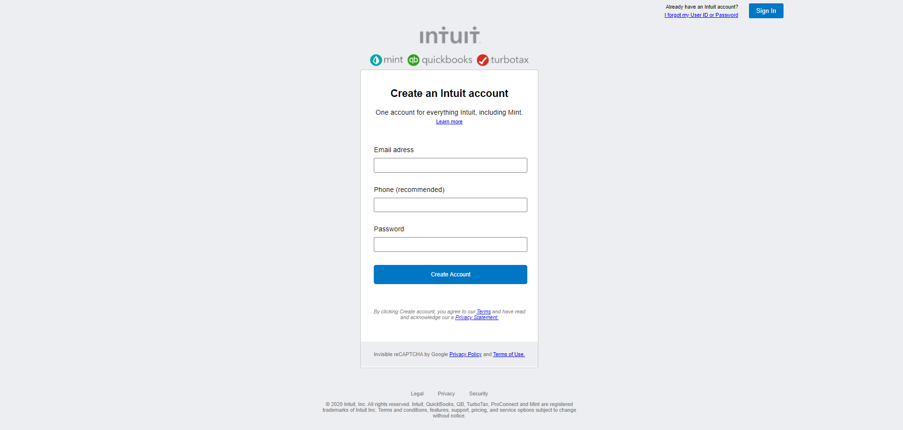

# Form

> We recreate a signup form from Mint.com page with just using HTML and CSS

We created a signup form that includes:
- header with signin button
- body with form element
- footer with legal information

## Built With

- HTML5
- CSS3

## Live Demo

[Live Demo Link](https://rawcdn.githack.com/jcy2704/Forms/648b2a83480a11222e6a440fc36731667a6bb25b/index.html)

## Getting Started

Is a form with input to record data for a signup into Mint Web Page

To get a local copy up and running follow these simple example steps.

### Prerequisites
Computer running Mac OS, Windows, or Linux Ubuntu.
Internet browser: Firefox, Google Chrome, Opera...

### Setup
Download the code or copy the git repository to your computer

### Usage
This is a model of a HTML Basic structure, usage just to admire our work.

### Run tests
Linters #13: Pull request #1 synchronize by alejandrotoledoweb

## Authors

👤 **Steven Jack Chung**

- GitHub: [@jcy2704](https://github.com/jcy2704)
- Twitter: [@yiak_](https://twitter.com/yiak_)
- LinkedIn: [LinkedIn](https://www.linkedin.com/in/stevenjchung)

👤 **Alejandro Toledo**

- GitHub: [@alejandrotoledoweb](https://github.com/alejandrotoledoweb)
- Twitter: [@alejot](https://twitter.com/alejot)
- LinkedIn: [LinkedIn](https://www.linkedin.com/in/alejandro-toledo/)

## 🤝 Contributing

Contributions, issues, and feature requests are welcome!

Feel free to check the [issues page](issues/).

## Show your support

Give a ⭐️ if you like this project!

## Acknowledgments

- Hat tip to anyone whose code was used
- Inspiration
- Youtube

## 📝 License

This project is [MIT](lic.url) licensed.
